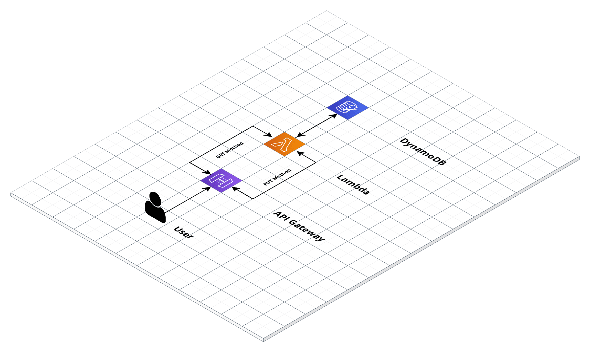

# some-challenge

Repository to store code that was used to solve an interview challenge.

## Challenge Description

* Design and code a simple "Hello World" application that exposes the following HTTP-based APIs:
  * Description: Saves/updates the given user’s name and date of birth in the database.
    * Request: PUT /hello/\<username\> { “dateOfBirth”: “YYYY-MM-DD” }
    * Response: 204 No Content
    * Note:
      * \<username\> must contain only letters.
      * YYYY-MM-DD must be a date before the today date.
  * Description: Returns hello birthday message for the given user
    * Request: GET /hello/\<username\>
    * Response: 200 OK
    * Response examples:
      * If username's birthday is in N days:

        ```json
        { "message": "Hello, <username>! Your birthday is in N day(s)"}
        ```

      * If username's birthday is in N days:

        ```json
        { "message": "Hello, <username>! Happy Birthday!"}
        ```

* Produce a system diagram of your solution deployed to either AWS or GCP (it's not required to support both cloud platforms).
* Write configuration scripts for building and no-downtime production deployment of this application, keeping in mind aspects that an SRE would have to consider.
* Implicit requirements:
  * The code produced by you is expected to be of high quality.
  * The solution must have tests, runnable locally, and deployable to the cloud.
  * Use common sense.
  * Please put your work on github or bitbucket.

## Architecture

To solve the challenge it was chosen `Python` as a programming language together with a serverless architecture in AWS using the following tools:

* AWS API Gateway
* AWS Lamda
* AWS DynamoDB



To perform the CI/CD pipelines and zero downtime deployments the following tools were chosen:

* Github Actions
* Terraform

Benefits of this Architecture:

* No need to manage servers so developers can focus their attention on product development.
* Faster deployments.
* Reduced architecture costs.

## Local Development

In order to spin up the environment and start developing locally the following tools are required:

* [docker](https://www.docker.com/)
* [aws-sam](https://aws.amazon.com/serverless/sam/)
* [aws-cli](https://aws.amazon.com/cli/)

Steps to spin up the local environment:

* Create a docker network called `some-challenge`

    ```bash
    docker network create some-challenge
    ```

* Start a local DynamoDB server using `amazon/dynamodb-local` docker image. This image should be joined to the `some-challenge` docker network created in the previous step.

    ```bash
    docker run -d --name dynamodb --network some-challenge -p 8000:8000 amazon/dynamodb-local
    ```

* Create a DynamoDB Table called `birthdays_table`

    ```bash
    aws dynamodb create-table --table-name birthdays_table \
        --attribute-definitions AttributeName=username,AttributeType=S \
        --key-schema AttributeName=username,KeyType=HASH \
        --billing-mode PAY_PER_REQUEST \
        --endpoint-url http://localhost:8000
    ```

* Start the local environment using sam. Note that the command should be run inside the folder `local-execution`

    ```bash
    cd hello/local-execution
    sam local start-api --docker-network some-challenge
    ```

* Lastly interact with the API using the following endpoint:

    ```bash
    http://localhost:3000/hello
    ```

## Production and Development Environments

To automatically deploy the code to the Development and Production environments github actions together with terraform are used. A github action workflow is triggered each time a push or pull request event is triggered to the branches `dev` and `main`.

If the event is a Pull Request event to either `dev` or `main` branches the following steps are run:

* Code checkout
* Python unit tests
* Terraform installation
* Terraform initialization
* Terraform workspace selection
* Terraform code validation
* Terraform plan

If the event is a push event to either `dev` or `main` branches the following steps are run:

* Code checkout
* Python unit tests
* Terraform installation
* Terraform initialization
* Terraform workspace selection
* Terraform code validation
* Terraform plan
* Terraform apply

## Improvements

* Add pylint step to the pipeline
* Improve unit-tests coverage
  * Finish and improve database unit-tests using moto to mock dynamoDB
* Implement integration tests
* Manual approval workflow for production deployments
* Route53 integration
* Cognito integration for authentication
